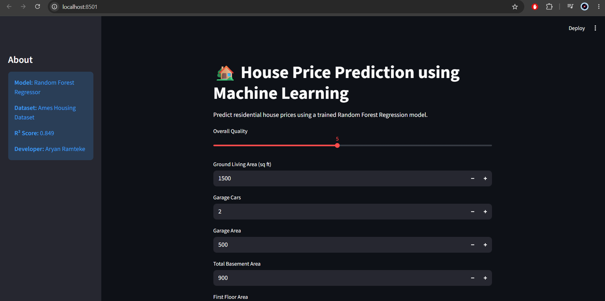
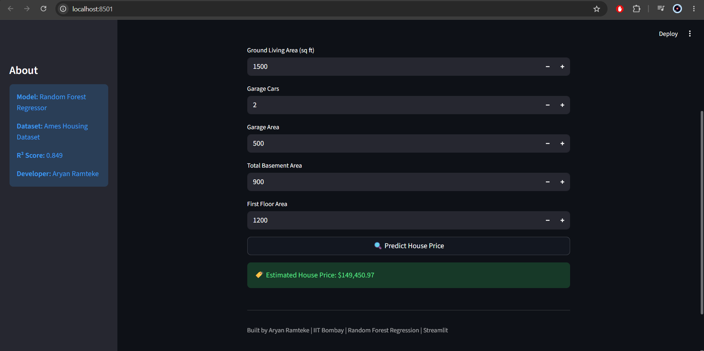
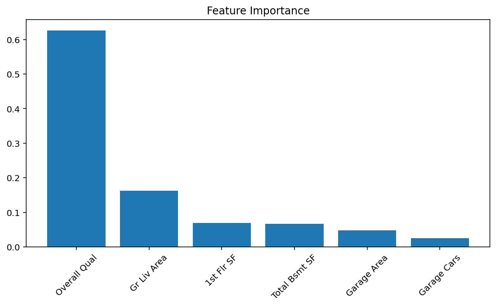

# 🏡 House Price Prediction using Machine Learning

An end-to-end Machine Learning project that predicts residential house prices using the Ames Housing Dataset. The project includes data preprocessing, exploratory data analysis (EDA), feature selection, model comparison, hyperparameter tuning, model deployment with Streamlit, and model serialization using Joblib.

---

## 🚀 Project Overview

This project was developed to understand the complete Machine Learning workflow—from raw data analysis to deployment of a predictive web application.

The project compares multiple regression models and identifies the best-performing model based on prediction accuracy.

## ✨ Features

- 📊 Exploratory Data Analysis (EDA)
- 🧹 Missing value handling
- 📈 Correlation analysis
- 🌲 Random Forest Regression
- 📉 Linear Regression
- 🌳 Decision Tree Regression
- ⚙️ Hyperparameter tuning using GridSearchCV
- 💾 Model saving with Joblib
- 🌐 Interactive Streamlit web application
- 📋 Feature importance visualization

## 🛠️ Tech Stack

- Python
- Pandas
- NumPy
- Matplotlib
- Scikit-learn
- Joblib
- Streamlit

## 📊 Model Performance

| Model | R² Score | MAE |
|--------|---------:|---------:|
| Random Forest Regressor | **0.8492** | **19,987.86** |
| Linear Regression | 0.7995 | 26,023.14 |
| Decision Tree Regressor | 0.7531 | 26,310.30 |

### 🏆 Best Model

The Random Forest Regressor achieved the highest prediction accuracy after hyperparameter tuning using **GridSearchCV**.

**Best Parameters**

- `n_estimators = 100`
- `max_depth = 10`

## 📷 Project Preview

### 🏠 Streamlit Application

  

---

### 💰 House Price Prediction

  

---

### 📊 Feature Importance

  

